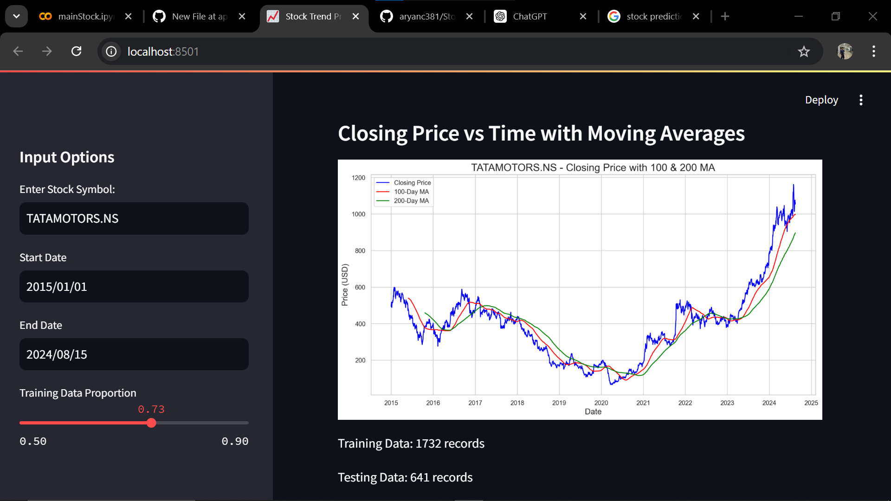

# 📊 Stock Trend Prediction Web App



This web app allows users to predict stock prices using a pre-trained Long Short-Term Memory (LSTM) model. It features a sleek and user-friendly interface that provides stock data visualization and predictions.

## 📝 Table of Contents

- [Project Overview](#project-overview)
- [Features](#features)
- [Installation](#installation)
- [Usage](#usage)
- [Steps to Create the Project](#steps-to-create-the-project)
- [Dataset and `yfinance` Integration](#dataset-and-yfinance-integration)
- [Model Details](#model-details)
- [LSTM Architecture](#lstm-architecture)
- [How LSTM Works with Images](#how-lstm-works-with-images)
- [Future Enhancements](#future-enhancements)
- [Contributing](#contributing)

## 📈 Project Overview

The Stock Trend Prediction Web App is designed to predict future stock prices based on historical data. Utilizing LSTM, a type of Recurrent Neural Network (RNN), the app is capable of capturing temporal dependencies in stock price movements. The app fetches real-time stock data using the Yahoo Finance API and displays the closing price trends, along with 100-day and 200-day moving averages, before predicting future prices.

## 🎨 Features

- **Real-Time Data Fetching**: Input a stock symbol to fetch real-time data from Yahoo Finance.
- **Interactive Visualizations**: Display of stock price trends with 100-day and 200-day moving averages.
- **Stock Price Predictions**: Predict future stock prices using a pre-trained LSTM model.
- **Download Option**: Download the stock data as a CSV file directly from the app.
- **Responsive UI**: A modern, responsive interface built with Streamlit.

## 🛠️ Installation

To set up the project locally, follow these steps:

### 1. Clone the Repository

```bash
git clone https://github.com/yourusername/stock-trend-prediction.git
cd stock-trend-prediction
```

### 2. Set Up a Virtual Environment

```bash
python -m venv venv
source venv/bin/activate  # On Windows: venv\Scripts\activate
```

### 3. Install Required Packages

```bash
pip install -r requirements.txt
```

### 4. Download the Pre-Trained Model

Place your pre-trained LSTM model (`stock_model_50_time.h5`) in the appropriate directory, as specified in your script.

### 5. Run the Web App

```bash
streamlit run app.py
```

The app should now be running on `http://localhost:8501`.

## 💻 Usage

1. **Enter the Stock Symbol**: Use the sidebar to enter a stock symbol (e.g., `AAPL` for Apple Inc.).
2. **Select Date Range**: Choose the start and end dates for the data.
3. **View Data**: Explore the descriptive statistics of the stock data.
4. **Visualize Trends**: See the stock's closing price over time with 100-day and 200-day moving averages.
5. **Predict Prices**: The app will display the predicted stock prices alongside the actual prices.
6. **Download Data**: Use the download button to save the stock data as a CSV file.

## 🧰 Steps to Create the Project

1. **Set Up the Environment**: Install Python, set up a virtual environment, and install necessary libraries like `pandas`, `numpy`, `matplotlib`, `seaborn`, `streamlit`, `yfinance`, and `keras`.
2. **Data Collection**: Use the `yfinance` library to download historical stock data from Yahoo Finance.
3. **Data Preprocessing**: Scale the data using `MinMaxScaler` for better performance with the LSTM model.
4. **Build the LSTM Model**: Construct a sequential model with four LSTM layers, each followed by dropout layers for regularization, and a dense output layer.
5. **Train the Model**: Train the model on the historical stock data for 50 epochs.
6. **Create the Web App**: Use Streamlit to build the front-end, allowing users to input stock symbols, visualize data, and see predictions.
7. **Deploy the App**: Run the app locally or deploy it on a platform like Heroku or Streamlit Sharing.

## 📊 Dataset and `yfinance` Integration

The dataset for this project is fetched in real-time using the `yfinance` library, which allows downloading historical market data from Yahoo Finance. The data includes the following fields:

- **Date**: The specific trading day.
- **Open**: The stock's opening price on that day.
- **High**: The highest price of the stock on that day.
- **Low**: The lowest price of the stock on that day.
- **Close**: The closing price of the stock on that day.
- **Volume**: The total number of shares traded on that day.

This data is used to visualize trends and to train and test the LSTM model.

## 🧠 Model Details

- **Architecture**: The LSTM model has multiple layers designed to capture the temporal dependencies in stock price movements.
- **Training Data**: The model was trained on historical stock price data from 2015 to 2024.
- **Preprocessing**: Data was normalized using MinMaxScaler before training, and inverse scaling is applied for prediction outputs.

## 🏗️ LSTM Architecture

The LSTM model used in this project is designed to capture sequential dependencies in stock prices. The architecture consists of:

- **Layer 1**: LSTM layer with 50 units, ReLU activation, `return_sequences=True`, and input shape of (100, 1). This is followed by a dropout layer with a dropout rate of 0.3.
- **Layer 2**: LSTM layer with 60 units, ReLU activation, and `return_sequences=True`. This is followed by a dropout layer with a dropout rate of 0.3.
- **Layer 3**: LSTM layer with 80 units, ReLU activation, and `return_sequences=True`. This is followed by a dropout layer with a dropout rate of 0.4.
- **Layer 4**: LSTM layer with 120 units and ReLU activation. This is followed by a dropout layer with a dropout rate of 0.5.
- **Output Layer**: A dense layer with 1 unit to predict the stock price.

The model was trained for 50 epochs to ensure accurate predictions.

## 🖼️ How LSTM Works with Images

LSTM (Long Short-Term Memory) networks are primarily designed for sequence data, but they can be adapted to work with images by treating image data as a sequence. Here’s how it works:

1. **Image Preprocessing**: An image is usually converted into a sequence of pixel values. For example, an image can be flattened into a 1D sequence where each pixel’s value is treated as a timestep in the sequence.
  
2. **Sequence Modeling**: The LSTM layers process the sequence of pixel values, learning to capture spatial dependencies and patterns in the image data over time.

3. **Output Generation**: After processing, the LSTM can output a prediction, which might be a classification label, a sequence of labels, or some other result, depending on the task.

This approach is particularly useful for tasks like video classification or sequence prediction where each frame or segment of the video can be treated as a timestep in the sequence.

## 🚀 Future Enhancements

- **Multi-Stock Prediction**: Support for predicting multiple stocks simultaneously.
- **Advanced Visualization**: Include more technical indicators and charting tools.
- **Model Updates**: Allow users to train the model on new data directly from the app.
- **Mobile Optimization**: Improve the UI for mobile devices.

## 🤝 Contributing

Contributions are welcome! Please follow these steps:

1. Fork the repository.
2. Create a new branch (`git checkout -b feature/your-feature-name`).
3. Commit your changes (`git commit -am 'Add new feature'`).
4. Push to the branch (`git push origin feature/your-feature-name`).
5. Open a Pull Request.

---
